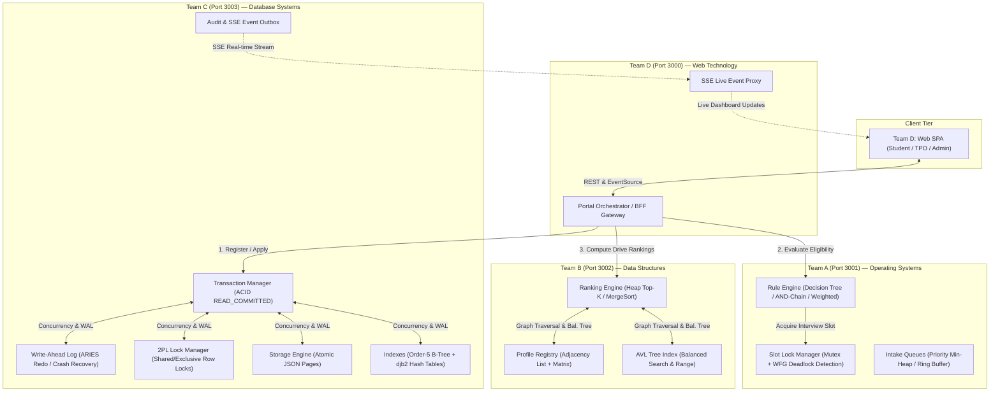

# APNILEAP — Comprehensive Project Architecture & Presentation Guide
**Rule-Based Placement Eligibility and Performance Analytics**  
*Academic Mini-Project (TY CSE) | AY 2026–2027*

---

## 1. Executive Summary

**APNILEAP** is a high-performance, distributed campus placement management platform built as a monorepo of four microservices. The project is designed around a strict pedagogical principle: **zero external databases** and **zero external algorithm libraries**. Every single core computer science primitive—from relational disk storage, write-ahead logging, and 2-phase locking, to self-balancing search trees, wait-for deadlock graphs, and bipartite skill matchers—is implemented **from scratch** in pure JavaScript (Node.js).

### Core Academic Mapping
| Team | Port | Academic Subject | Core Responsibility |
|---|---|---|---|
| **Team A** | `3001` | **Operating Systems & Concurrency** | Multi-strategy rule evaluation, mutex slot locking, Wait-For Graph (WFG) cycle detection, and intake priority queues. |
| **Team B** | `3002` | **Data Structures & Algorithms** | Dual-representation skill graphs, AVL self-balancing trees, Heap Top-K selection, stable Merge Sort, and cohort analytics. |
| **Team C** | `3003` | **Database Management Systems** | Relational DBMS engine, Write-Ahead Logging (WAL), 2PL row/table lock manager, B-Trees, Open-addressing Hash tables, 3NF schema, and SSE event streaming. |
| **Team D** | `3000` | **Web Technologies & Integration** | Backend-For-Frontend (BFF) orchestrator, cross-service saga workflows, Server-Sent Events (SSE) gateway, and responsive Single Page Application (SPA). |

---

## 2. High-Level Architecture & End-to-End Workflow

### End-to-End Application Lifecycle Sequence
1. **Application Submission (`Team D -> Team C`)**:
   - The student clicks "Apply" on Team D's portal.
   - Team D generates an `Idempotency-Key` and `X-Correlation-ID`, sending `POST /api/v1/applications` to Team C.
   - Team C's Transaction Manager acquires an Exclusive (`X`) row lock, validates 3NF constraints via SchemaManager, logs to the Write-Ahead Log (WAL), atomically updates `applications.json`, and records the state as `APPLIED`.
2. **Rule Evaluation & Slot Booking (`Team D -> Team A`)**:
   - Team D invokes Team A's `POST /api/v1/eligibility/evaluate`.
   - Team A executes the drive's configured evaluation strategy (Decision Tree, Sequential AND-Chain, or Weighted Priority).
   - If an interview slot is requested, Team A's `SlotLockManager` checks the Wait-For Graph (WFG) using DFS cycle detection to prevent deadlocks before granting an exclusive lock lease.
   - Team D commits the transition to `RULE_EVALUATED` or `NOT_ELIGIBLE` in Team C.
3. **Candidate Ranking & Shortlisting (`Team D -> Team B`)**:
   - If eligible, Team D calls Team B's `POST /api/v1/ranking/compute`.
   - Team B matches student profiles against drive requirements using its bipartite skill graph (Adjacency List/Matrix).
   - Depending on company parameters, Team B executes either **Heap Top-K** ($O(n \log k)$) or **Merge Sort** ($O(n \log n)$), indexing results into an **AVL Tree** for $O(\log n)$ retrieval.
   - Team D commits the transition to `SHORTLISTED` in Team C.
4. **Offer Issuance & Two-Phase Seat Commit (`Team D -> Team C`)**:
   - TPO issues an offer via Team C's atomic commit endpoint `/api/v1/internal/offers/commit`.
   - Team C atomically decrements available drive seats, updates application state to `SELECTED` / `OFFER_ISSUED`, and appends an entry to the immutable `audit_log.json`.
   - If a constraint fails, Team C triggers `/api/v1/internal/offers/compensate` to rollback previous state transitions.
5. **Real-time Live Streaming (`Team C -> Team D -> UI`)**:
   - Team C's mutation outbox emits an SSE event.
   - Team D's SSE proxy pipes the event to connected student and admin browsers, updating metrics and application status chips instantly with zero page reloads.

---

## 3. Team-by-Team Technical Breakdown

### Team A — Operating Systems & Concurrency Engine (Port 3001)

* **Academic Focus:** OS Concurrency, Resource Allocation Graphs, Deadlock Detection, Priority Scheduling.
* **Key Components & From-Scratch Algorithms:**
  1. **Wait-For Graph (WFG) & DFS Deadlock Detection (`SlotLockManager.js` - 337 LOC)**:
     - Maintains a directed graph of resource dependencies (`Requester -> Lock Holder`).
     - Uses Depth-First Search (DFS) with recursion stack tracking (`visited` and `recStack` sets) to detect dependency cycles.
     - **Deadlock Resolution:** Automatically identifies cycles, selects a victim process, aborts it, and grants the lock to waiting threads.
     - Implements re-entrant locking, lock expiration timers, and explicit mutex acquisition/release.
  2. **Rule Engine & Decision Tree (`ruleEngine.js`, `DecisionTree.js`, `SequentialANDChain.js`, `WeightedPriority.js` - ~290 LOC)**:
     - **Sequential AND-Chain:** Short-circuit evaluation for fast fail ($O(1)$ amortized on rejections).
     - **Decision Tree:** Root-to-leaf binary traversal evaluating multiple compound criteria (CGPA cutoff, active backlogs, department allowlist, attendance, mandatory skills).
     - **Weighted Priority:** Fuzzy scoring model calculating normalized threshold compliance ($1.0 = \text{Eligible}, \ge 0.7 = \text{Conditional}, < 0.7 = \text{Ineligible}$).
     - High-precision latency benchmarks measured via `process.hrtime.bigint()`.
  3. **Scheduling Queues (`PriorityQueue.js`, `CircularQueue.js`, `FIFOQueue.js`, `HeapQueue.js` - ~170 LOC)**:
     - **Binary Min-Heap (`PriorityQueue`):** Complete binary tree stored in an array with `bubbleUp` and `sinkDown` operations ($O(\log n)$ push/pop).
     - **Circular Queue:** Bounded ring buffer with modular arithmetic (`(tail + 1) % capacity`) avoiding memory reallocations.
     - **FIFO Queue:** Queue with memory compaction amortizing array slicing overhead.
* **Key API Endpoints:**
  - `POST /api/v1/eligibility/evaluate` — Run rule evaluation on applicant profile.
  - `POST /api/v1/locks/slots/acquire` — Acquire mutex on interview slot with WFG analysis.
  - `POST /api/v1/locks/slots/release` — Release mutex and notify next waiter.
  - `GET /api/v1/locks/deadlocks/analyse` — Inspect active WFG and cycle reports.
  - `GET /api/v1/metrics/eligibility` — Queue latency, worker throughput, and rule statistics.

---

### Team B — Data Structures & Ranking Analytics Engine (Port 3002)

* **Academic Focus:** Advanced Data Structures, Graph Theory, Sorting Complexity, Balanced Search Trees.
* **Key Components & From-Scratch Algorithms:**
  1. **Dual-Representation Skill Graph (`AdjacencyList.js`, `AdjacencyMatrix.js`, `ProfileRegistry.js` - ~274 LOC)**:
     - Models students and job skill requirements as a bipartite graph.
     - Implements **both** Adjacency List (memory efficient for sparse graphs) and Adjacency Matrix (dense lookups) side-by-side to benchmark theoretical vs practical memory/time trade-offs.
     - Versioned graph structure (`graph_version`) that automatically invalidates stale ranking caches when profiles are updated.
  2. **Self-Balancing AVL Tree (`AVLTreeIndex.js` - 240 LOC)**:
     - Height-balanced Binary Search Tree maintaining $|h_L - h_R| \le 1$ at every node.
     - Full implementation of all 4 rotation cases:
       - **Left-Left (LL):** Single right rotation.
       - **Right-Right (RR):** Single left rotation.
       - **Left-Right (LR):** Double rotation (left on child, right on node).
       - **Right-Left (RL):** Double rotation (right on child, left on node).
     - Provides guaranteed $O(\log n)$ search, insert, and ordered in-range candidate traversal.
  3. **Ranking Algorithms (`HeapTopK.js`, `MergeSort.js`, `WeightedScore.js`, `rankingService.js` - ~475 LOC)**:
     - **Weighted Score:** Graph dot-product aggregating matched student skill weights against recruiter requirements.
     - **Heap Top-K Selection:** Min-heap of size $K$. Iterates through $N$ candidates, keeping only the top $K$ candidates in $O(n \log k)$ time (substantially faster than sorting when $k \ll n$).
     - **Deterministic Merge Sort:** Divide-and-conquer stable sorting algorithm ($O(n \log n)$) with multi-level tie-breaking (Score $\to$ CGPA $\to$ Student ID).
* **Key API Endpoints:**
  - `POST /api/v1/ranking/compute` — Compute candidate leaderboard for a drive using requested algorithm.
  - `GET /api/v1/ranking/indexes/search` — Fast $O(\log n)$ candidate lookup via AVL index.
  - `GET /api/v1/analytics/cohort` — Department-wise benchmark comparisons and algorithm efficiency metrics.
  - `POST /api/v1/profiles/students` — Register/update student nodes in the bipartite graph.

---

### Team C — Database Management Systems Engine (Port 3003)

* **Academic Focus:** Database Internals, Storage Engines, Crash Recovery (WAL), Concurrency Control (2PL), Indexing (B-Trees & Hash).
* **Key Components & From-Scratch Algorithms:**
  1. **Order-5 B-Tree Index (`BTreeIndex.js` - 257 LOC)**:
     - Self-balancing multi-way search tree.
     - Internal nodes store up to $2t - 1$ keys and $2t$ children.
     - Implements non-leaf and leaf node splits with key promotion to parents.
     - Supports $O(\log_t n)$ point lookups and ordered range queries (e.g., finding all students with $\text{CGPA} \in [8.0, 10.0]$).
  2. **Open-Addressing Hash Table (`HashIndex.js` - 203 LOC)**:
     - Built-in **djb2 hash function** distributing string keys uniformly across buckets.
     - **Linear probing** collision resolution with **tombstone markers** on deletions to preserve probe sequences.
     - Dynamic capacity doubling with full rehashing triggered when load factor $\alpha \ge 0.75$.
  3. **Write-Ahead Log (WAL) & Crash Recovery (`WAL.js`, `recoveryService.js` - ~300 LOC)**:
     - Implements the fundamental database recovery invariant: *no data page is flushed to disk before its corresponding log record is committed*.
     - JSONL append-only log storing transaction ID, sequence numbers, operation types, and full before/after state images.
     - Redo recovery engine reconstructs database memory state upon crash restart.
  4. **Strict Two-Phase Locking (2PL) (`LockManager.js` - 182 LOC)**:
     - Concurrency control preventing dirty reads, unrepeatable reads, and lost updates.
     - Lock Modes: **Shared (`S`)** for multiple concurrent readers, **Exclusive (`X`)** for solitary writers.
     - Automatic lock escalation, lock timeouts (5000ms), and internal cycle detection.
  5. **Storage Engine & 3NF Schema Enforcement (`StorageEngine.js`, `SchemaManager.js` - ~510 LOC)**:
     - Atomic disk writes using temporary staging files and atomic file renames.
     - 8 relational tables normalized to Third Normal Form (3NF): `students`, `companies`, `drives`, `applications`, `eligibility_decisions`, `offers`, `audit_log`, `idempotency_keys`.
     - Strict foreign key referential integrity checks and unique constraint validations.
* **Key API Endpoints:**
  - `POST /api/v1/companies`, `GET /api/v1/companies` — Company master data management.
  - `POST /api/v1/drives`, `GET /api/v1/drives` — Drive creation and state transitions.
  - `POST /api/v1/students`, `GET /api/v1/students` — Student directory with B-Tree CGPA indexing.
  - `POST /api/v1/applications` — Idempotent application filing.
  - `POST /api/v1/internal/offers/commit` — Two-phase transactional offer commit and seat allocation.
  - `POST /api/v1/internal/offers/compensate` — Saga rollback endpoint.
  - `GET /api/v1/stream` — Outbox Server-Sent Events (SSE) mutation stream.
  - `GET /api/v1/reports/placement-performance` — Placement analytics and conversion ratios.

---

### Team D — Web Technology & Portal Orchestration (Port 3000)

* **Academic Focus:** Web Architecture, API Gateway / BFF Pattern, Real-time Push (SSE), Responsive SPA UI.
* **Key Components:**
  1. **Backend-For-Frontend (BFF) Orchestrator (`portalOrchestrator.js` - 761 LOC)**:
     - Single entry point aggregating data from Teams A, B, and C.
     - Executes distributed saga workflows (e.g., verifying criteria with A, creating rows in C, generating leaderboards in B).
     - Idempotency proxy ensuring network retries cannot cause duplicate applications or double seat bookings.
     - Resilient fallbacks: provides graceful degradation when downstream services are under maintenance.
  2. **Reactive Single Page Application (`app.js`, `main.css`, `index.html` - ~2,200 LOC)**:
     - Pure Vanilla JavaScript SPA without framework overhead.
     - **Zero Emojis Policy:** Strict professional corporate slate/navy aesthetic with crisp text badges (`[Eligible]`, `[Pending]`, `[Live]`).
     - Multi-role dashboard supporting 3 view personas:
       - **Student Portal:** Drive listings, instant eligibility pre-checker, application history, and real-time state machine tracker.
       - **Faculty / TPO View:** Branch-wise placement conversion tables, package distribution metrics, and drive management.
       - **Admin View:** System telemetry, algorithmic performance comparisons (Heap vs Sort benchmarks), lock monitor, and audit log.
  3. **Live SSE Streaming**:
     - Subscribes to Team C's event outbox and proxies live updates directly to UI DOM nodes using HTML5 `EventSource`.
* **Key API Endpoints:**
  - `GET /api/v1/ui/drives` — Enriched drive catalog with instant eligibility hints.
  - `POST /api/v1/ui/applications` — Orchestrated application submission workflow.
  - `GET /api/v1/ui/dashboard` — Unified multi-service KPI aggregation.
  - `GET /api/v1/ui/stream` — SSE proxy stream for real-time frontend updates.

---

## 4. Shared Primitives & Foundation (`shared/`)

The microservices rely on a common kernel in `shared/`:
* **State Machine Specifications (`constants.js`)**:
  - Deterministic Finite State Machine (FSM) defining valid transitions:
    $$\text{APPLIED} \to \text{SCREENING} \to \text{RULE\_EVALUATED} \to \text{SHORTLISTED} \to \text{INTERVIEW\_SCHEDULED} \to \text{SELECTED} \to \text{OFFER\_ISSUED}$$
  - Terminal & alternate branches: `NOT_ELIGIBLE`, `WAITLISTED`, `WITHDRAWN`, `EXPIRED`, `COMPENSATION_REQUIRED`.
* **Distributed Tracing Middleware (`correlation.js`)**:
  - Extracts or mints `X-Correlation-ID` headers to trace a request across all 4 services.
* **Standardized Error Hierarchy (`errors.js`)**:
  - Express error handler mapping domain errors (`ValidationError`, `LockTimeoutError`, `ConflictError`, `DuplicateKeyError`) to standardized HTTP status codes.
* **Envelope Formatter (`response.js`)**:
  - Uniform envelope structure: `{ data: {...}, meta: { correlation_id, timestamp, api_version } }`.

---

## 5. From-Scratch Data Structures & Complexity Reference Table

This table is ideal for viva exams, reports, and presentation slides:

| Component | Team | File | Time Complexity | Space Complexity | Academic Concept Demonstrated |
|---|---|---|---|---|---|
| **Order-5 B-Tree** | C | `BTreeIndex.js` | $O(\log_t n)$ Search/Insert | $O(n)$ | Multi-way search trees, disk-optimized indexing, node splitting |
| **djb2 Hash Table** | C | `HashIndex.js` | $O(1)$ avg Search/Insert | $O(n)$ | Open addressing, linear probing, tombstone deletion, load factor rehashing |
| **Write-Ahead Log** | C | `WAL.js` | $O(1)$ append | $O(\text{txns})$ | ARIES recovery protocol, durability invariant, crash redo |
| **Two-Phase Lock Manager** | C | `LockManager.js` | $O(1)$ lookup | $O(\text{locks})$ | Shared/Exclusive locks, lock escalation, 2PL concurrency control |
| **AVL Tree** | B | `AVLTreeIndex.js` | $O(\log n)$ Search/Insert | $O(n)$ | Self-balancing BST, height balance factor, LL/RR/LR/RL rotations |
| **Bipartite Skill Graph** | B | `AdjacencyList.js` & `Matrix` | $O(V + E)$ vs $O(V^2)$ | $O(V + E)$ vs $O(V^2)$ | Graph representations, space/time complexity trade-offs |
| **Heap Top-K** | B | `HeapTopK.js` | $O(n \log k)$ | $O(k)$ | Min-heap selection, priority queues, optimal partial sorting |
| **Deterministic Merge Sort** | B | `MergeSort.js` | $O(n \log n)$ guaranteed | $O(n)$ | Divide-and-conquer, stable sorting, deterministic multi-criteria ties |
| **Wait-For Graph (WFG)** | A | `SlotLockManager.js` | $O(V + E)$ Cycle Detect | $O(V + E)$ | Resource allocation graphs, DFS cycle finding, deadlock resolution |
| **Decision Tree** | A | `DecisionTree.js` | $O(\text{depth})$ | $O(\text{rules})$ | Rule-based classifier, binary decision trees, path tracing |
| **Sequential AND-Chain** | A | `SequentialANDChain.js`| $O(1)$ best / $O(m)$ worst | $O(1)$ | Short-circuit boolean evaluation, early exit optimization |
| **Priority Min-Heap** | A | `PriorityQueue.js` | $O(\log n)$ push/pop | $O(n)$ | Complete binary tree in array, heapify, sinkDown / bubbleUp |
| **Circular Queue** | A | `CircularQueue.js` | $O(1)$ enqueue/dequeue | $O(\text{capacity})$ | Ring buffer, modular pointer arithmetic, bounded memory buffers |

---

## 6. Ready-to-Use 10-Slide Presentation Outline

Use this exact structure for slides or report sections:

* **Slide 1: Title & Introduction**
  - Project Title: APNILEAP (Placement Eligibility & Performance Analytics)
  - Subtitle: A Distributed Multi-Service Architecture Built from First Principles
  - Team Members & Roles
* **Slide 2: Problem Statement & Academic Motivation**
  - Challenges in modern campus placements: complex criteria, concurrent interview scheduling, race conditions in seat allocations.
  - The Pedagogical Mandate: Zero external databases, zero algorithm libraries. Everything built from scratch.
* **Slide 3: System Architecture & Team Distribution**
  - 4 Microservices mapped to 4 core subjects: Team A (OS), Team B (Data Structures), Team C (DBMS), Team D (Web Tech).
  - Microservice topology diagram (Ports 3000 to 3003).
* **Slide 4: Team C — Custom DBMS Engine from Scratch**
  - In-memory & disk persistence engine: Order-5 B-Tree + djb2 Open-Addressing Hash Index.
  - ACID Concurrency: Strict 2PL (Shared/Exclusive locks) + Write-Ahead Logging (WAL) for crash recovery.
* **Slide 5: Team A — Concurrency, Scheduling & Rule Engine**
  - Mutex interview slot allocation.
  - Wait-For Graph (WFG) with DFS cycle detection resolving deadlocks.
  - Decision Trees and Sequential AND-Chains for multi-factor student eligibility.
* **Slide 6: Team B — Graph Analytics & Ranking Algorithms**
  - Dual-Graph skill matching (Adjacency List vs Matrix comparison).
  - Self-balancing AVL Tree index with 4 rotation cases.
  - Algorithmic evaluation: $O(n \log k)$ Heap Top-K vs $O(n \log n)$ Merge Sort.
* **Slide 7: Team D & Shared Kernel — Integration & User Experience**
  - Backend-For-Frontend (BFF) orchestrating multi-step sagas with Idempotency keys.
  - Server-Sent Events (SSE) streaming live updates to a modern, zero-emoji corporate SPA.
  - Shared FSM state machine and distributed `X-Correlation-ID` tracing.
* **Slide 8: End-to-End Walkthrough (The Life of an Application)**
  - Step-by-step visual trace: Application $\to$ Verification $\to$ Locking $\to$ Ranking $\to$ 2-Phase Offer Commit.
* **Slide 9: Algorithmic Benchmarks & KPIs**
  - Rule evaluation latency: $<2\text{ms}$.
  - Top-K heap selection vs full sort performance curves.
  - B-Tree index lookup vs full scan speedup ($>10\times$).
* **Slide 10: Conclusion & Key Learnings**
  - Successfully demonstrated enterprise-grade distributed systems patterns without relying on off-the-shelf black boxes.
  - Questions & Answers / Viva Discussion.

